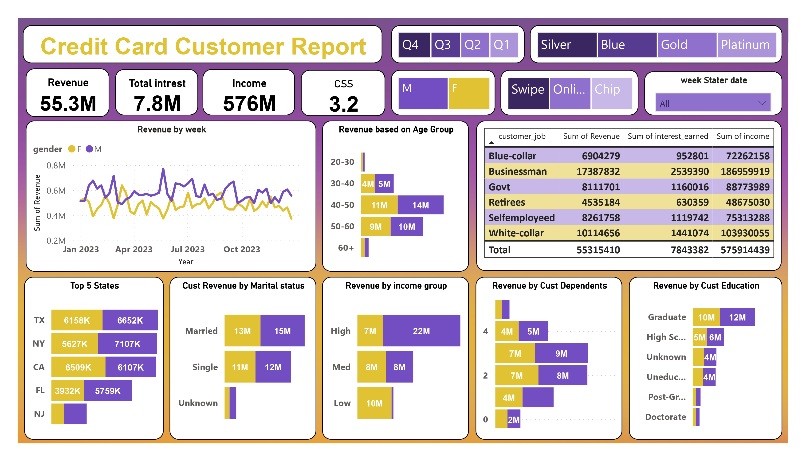
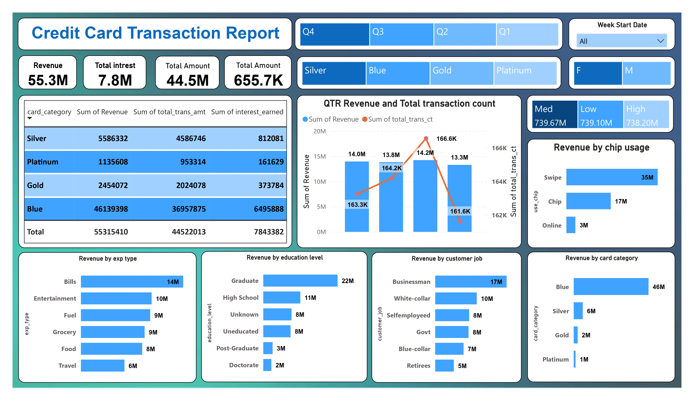

# 💳 Credit Card Financial Dashboard (Power BI)

## 📌 Project Overview

This interactive Power BI dashboard simulates a real-world **credit card portfolio analysis** for a financial institution. The goal was to uncover revenue drivers, customer segments, and transaction patterns to support data-driven decisions. The dashboards provide a 360° view of performance, enabling executives to spot trends and act quickly.

### 🎯 Key Business Questions Answered

- Which customer segments (income, education, marital status) generate the most revenue?
- How do different card categories (Blue, Silver, Gold, Platinum) perform?
- What are the top states by revenue, and how do transaction methods (chip, swipe, online) compare?
- How does revenue trend over time, and what are the seasonal patterns?

## 📊 Dashboards & Insights

### 1. Customer Overview Dashboard

**Insights that drive action**:
- **Married & High‑Income segments** contribute the most revenue (₹13M and ₹15M respectively) → target them with premium perks.
- **Graduates** lead among education levels (₹10M) → consider alumni partnerships.
- **California, Texas, New York** account for 60%+ of revenue → focus marketing spend here.
- Revenue from both genders is **steadily growing** (0.2M → 0.8M in 2023) → maintain momentum with inclusive campaigns.

### 2. Transaction Dashboard

**Insights that drive action**:
- **Blue cards** dominate (83% of revenue, ₹46.1M) → protect this base with loyalty programs.
- **Chip transactions** bring in ₹35M, nearly double online (₹17M) → invest in contactless infrastructure.
- **Q4 revenue spike** (₹10M) suggests holiday season opportunity → plan promotions accordingly.

## 💡 Project Impact

- **Identified ₹46.1M revenue stream** (Blue cards) that can be further monetized.
- **Pinpointed top 3 states** responsible for 60%+ revenue, enabling targeted marketing.
- **Uncovered seasonal trend** (Q4 peak) to optimize campaign timing.
- **Revealed chip usage dominance**, guiding investment in payment technology.

## 🛠️ Technical Toolkit

- **Power BI**: Data modeling, DAX measures, interactive dashboards
- **SQL**: Data extraction and transformation
- **Excel**: Initial data exploration and cleaning

## 🚀 How to Explore This Project

1. Clone the repo  
   `git clone https://github.com/imramraja/Credit-Card-Financial-Dashboard.git`
2. Open `Credit_Card_Dashboard.pbix` in Power BI Desktop.
3. Interact with filters (card category, time period, region) to see dynamic updates.

## 📁 Repository Contents

- `Dashboards/` – Screenshots of the two dashboards
- `Credit_Card_Dashboard.pbix` – Power BI file
- `README.md` – You are here

## 📈 Future Enhancements

- Incorporate **predictive modeling** (e.g., next quarter revenue forecast)
- Add **customer churn analysis** using historical data
- Automate data refresh with SQL database integration

## 🙋‍♂️ About Me

I’m a recent graduate passionate about turning raw data into strategic business insights. This project reflects my ability to:
- Think critically about business problems
- Build clean, interactive visualizations
- Communicate findings clearly

**Let’s connect!**  
[LinkedIn](https://www.linkedin.com/in/iamramraja/) | [GitHub](https://github.com/imramraja)
